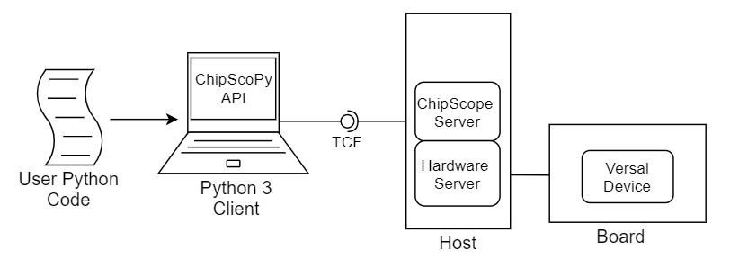
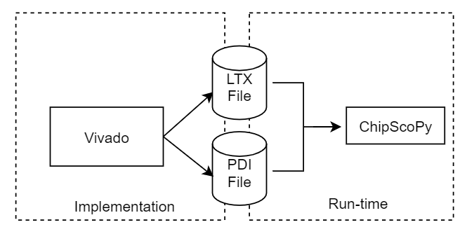

# 🐍 ChipScoPy README

[](https://github.com/psf/black)

**THIS IS AN EARLY DEVELOPMENT RELEASE - DO NOT REDISTRIBUTE**

The ChipScoPy API is under construction. Expect frequent changes and additions during this rapid development cycle.

## Contents

-   [About The Project](#about-the-project)
-   [Prerequisites](#prerequisites)
    -   [Software and System
        Requirements](#software-and-system-requirements)
-   [Installation and Setup](#installation-and-setup)
    -   [Xilinx Internal Network Only](#xilinx-internal-network-only)
    -   [Set Up a Virtual Environment](#set-up-a-virtual-environment)
    -   [Install ChipScoPy Python API](#install-chipscopy-python-api)
    -   [Install ChipScoPy Examples](#install-chipscopy-examples)
    -   [Install Jupyter Notebook](#jupyter-notebook-optional)
-   [ChipScoPy API Documentation](#chipscopy-api-documentation)
-   [Source Code](#source-code)
-   [Custom Designs](#custom-designs)
-   [License](#license)

## About The Project

ChipScoPy is an open-source project from Xilinx® that enables high-level control of the Versal debug IP running in hardware. Using a simple Python API, developers can control and communicate ChipScope® debug IP such as the Integrated Logic Analyzer (ILA) trigger, Virtual IO (VIO), device memory access, and more.



The Python code in this library is being actively developed for a 2021.1 open source release. The API is expected to change frequently during development. It is being released to select users now for early exercising and feedback.

## Prerequisites

### Software and System Requirements

***Operating System***

- Windows 10
- CentOS/RHEL 7.4-7.8, 8.1-8.2
- Ubuntu 18.04, 20.04

***Python Environment***

- Python 3.8
-   Download from the Microsoft Store or [python.org](https://www.python.org/downloads/)

***Supported Boards For Examples***

- [VCK190](https://www.xilinx.com/products/boards-and-kits/vck190.html)
- [VMK180](https://www.xilinx.com/products/boards-and-kits/vmk180.html)

***Xilinx Runtime Software***

- Xilinx Hardware Server - 2021.1
- Xilinx ChipScope Server - 2021.1
- See the [Xilinx Software Download Page](https://www.xilinx.com/support/download.html)

***Python Experience***

- The ChipScoPy API assumes some existing familiarity with Python 3
- Jupyter notebook examples are provided for step-by-step code explanations


## Installation and Setup

-   Assumes above prerequisites are met
-   Set up a Virtual Environment
-   Install ChipScoPy Python API
-   Install ChipScoPy Examples
-   Install Jupyter Notebook

### Xilinx Internal Network Only

***REMOVE BEFORE PUBLIC DISTRIBUTION***

Xilinx IT policies create additional certificate complications that must be addressed before setting up ChipScoPy. Follow these instructions if you are using the Xilinx Internal network.

#### Xilinx Internal Network Windows Configuration

For Microsoft Windows, we designed a script that help automate the install process. 

Bring up a **Windows Powershell**. Make sure Python 3.8 is available in your path by checking the version as shown below.  If Python is not executable from the console, stop and check your installation. Make sure Python has been installed from the Microsoft Store or python.org. Nothing works without a functional Python installation.

    PS > python --version
    Python 3.8.3


On Windows, copy and paste the snippet below into the **Powershell** window. Follow the interactive installer. 

    (Invoke-WebRequest -Uri https://gitenterprise.xilinx.com/chipscope/chipscopy/raw/master/docs/internal/get-chipscopy.py -OutFile get-chipscopy.py); python .\get-chipscopy.py


On Linux, copy and past the snippet below into the **terminal**. Follow the interactive installer. 

    curl -sSL https://gitenterprise.xilinx.com/chipscope/chipscopy/raw/master/docs/internal/get-chipscopy.py -o get-chipscopy.py; python get-chipscopy.py

Invoking the above script will:

1. Validate the python version used.
2. Create the certificate bundle needed to install ChipScopy from Xilinx Artifactory
3. Create a virtual environment install ChipScoPy (and opt dependencies) 
4. Install the examples
5. Optionally launch jupyter notebook server
6. Optionally install a shortcut for the user

So skip those steps below if the installer already performed them.

Proceed to the [install jupyter notebook](#jupyter-notebook-optional)
step below.

#### Xilinx Internal Network Linux Configuration

Option 1 - Install your own Python 3.8 distribution. Methods vary so no documentation is provided here. You can visit 3rd party distributions such as [Anaconda.org](https://anaconda.org/) for a pre-configured, full featured python environment for Linux.

Option 2 - Use the Python 3.8 built into Vivado 2021.1

Assuming you are using the bash environment:

```
export PYTHON=/proj/xbuilds/HEAD_daily_latest/installs/lin64/Vivado/HEAD/tps/lnx64/python-3.8.3
export PATH="${PYTHON}/bin:${PATH}"
export LD_LIBRARY_PATH="${PYTHON}/lib:${LD_LIBRARY_PATH}"

python3 -m pip config set global.extra-index-url https://artifactory.xilinx.com/artifactory/api/pypi/pypi/simple
python3 -m pip config set global.cert /etc/pki/tls/cert.pem
```

### Set Up a Virtual Environment

A virtual environment is a convenient sandbox for python work. Set up is simple. From a terminal, change directory to the location you want to hold the environment files. 
On Linux, the Python command is often "python3". On windows, Python is named "python". Always use your Python 3.8 command name for your operating system in examples below.

    python -m venv my_venv  (Windows)
    python3 -m venv my_venv (Linux)

After creating the environment, source the appropriate environment setup script for the operating system shell.

    my_venv\Scripts\activate.bat  (Windows Command Prompt)
    my_venv\Scripts\activate.ps1  (Windows Powershell)
    
    source my_venv/bin/activate   (Linux Bash)

Python.org has detailed documentation for [virtual environments](https://docs.python.org/3.8/tutorial/venv.html).

### Install ChipScoPy Python API

ChipScoPy is available on PyPI for pip installation: 

    python -m pip install chipscopy

### Install ChipScoPy Examples

Pre-compiled examples are provided for device programming, ILA, VIO, Memory access, and other features for the VCK190 board.

After installing ChipScoPy, examples can be extracted at the console current directory with the command :

    chipscopy-get-examples

### Jupyter Notebook (Optional)

Jupyter notebooks are a nice environment for running the ChipScoPy examples step by step. This is an optional step. To install Jupyter Notebook:

    pip install notebook

To run:

    jupyter notebook

Click the link to bring up a browser. Navigate to the examples directory and load the desired example notebook file. For Jupyter details, see their documentation:

- [Jupyter Documentation](https://jupyter.org/install)

## ChipScoPy API Documentation

See the [latest API documentation](https://pages.gitenterprise.xilinx.com/chipscope/chipscopy/2021.1/) for details on Python API for each service.

## Source Code

-   <https://www.github.com/Xilinx/chipscopy>
-   [XilinxBoardStore](https://github.com/Xilinx/XilinxBoardStore)

## Custom Designs

ChipScoPy requires the PDI and LTX files from a Vivado implementation run to program a device and communicate with debug cores in the users design. The PDI file contains device programming information, and the LTX file contains hardware debug information for the design.



Vivado is required to create a custom PDI and LTX file. It is NOT required to use ChipScoPy at runtime.

## License

Copyright 2021 Xilinx, Inc.

Licensed under the Apache License, Version 2.0 (the "License");
you may not use this file except in compliance with the License.
You may obtain a copy of the License at

http://www.apache.org/licenses/LICENSE-2.0

Unless required by applicable law or agreed to in writing, software
distributed under the License is distributed on an "AS IS" BASIS,
WITHOUT WARRANTIES OR CONDITIONS OF ANY KIND, either express or implied.
See the License for the specific language governing permissions and
limitations under the License.

**Additional Licenses**

TCF source files are licensed under terms of the Eclipse Public License 2.0. 
For additional details, see 

https://www.eclipse.org/legal/epl-2.0/
