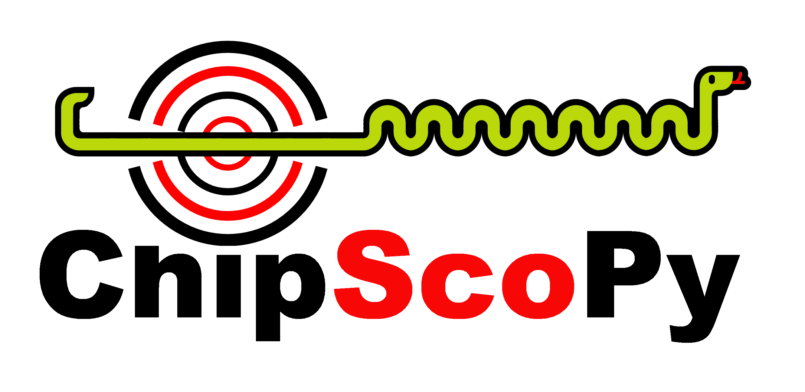

=========
ChipScoPy 
=========

.. image:: https://img.shields.io/badge/code%20style-black-000000.svg
  :target: https://github.com/psf/black

ChipScoPy is an open-source project from Xilinx® that enables high-level control of Versal debug IP running in hardware.
Using a simple Python API, developers can control and communicate with ChipScope® debug IP such as the Integrated Logic
Analyzer (ILA), Virtual IO (VIO), device memory access, and more.

-------------------------------------------------------------------------------

.. figure:: docs/images/chipscopy_overview.png
  :scale: 100%
  :align: center

  ChipScoPy System Diagram

-------------------------------------------------------------------------------

`ChipScoPy Overview <https://xilinx.github.io/chipscopy/2021.1/overview.html>`_

-------------------------------------------------------------------------------

`System Requirements <https://xilinx.github.io/chipscopy/2021.1/system_requirements.html>`_

-------------------------------------------------------------------------------

`ChipScoPy Installation <https://xilinx.github.io/chipscopy/2021.1/chipscopy_installation.html>`_

-------------------------------------------------------------------------------

`Developer Installation <https://xilinx.github.io/chipscopy/2021.1/dev_setup.html>`_

-------------------------------------------------------------------------------

Comprehensive documentation on `xilinx.github.io/chipscopy <https://xilinx.github.io/chipscopy/>`_

-------------------------------------------------------------------------------
