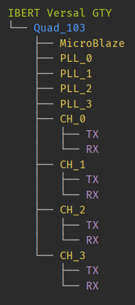

..
  Copyright 2021 Xilinx, Inc.

  Licensed under the Apache License, Version 2.0 (the "License");
  you may not use this file except in compliance with the License.
  You may obtain a copy of the License at

      http://www.apache.org/licenses/LICENSE-2.0

  Unless required by applicable law or agreed to in writing, software
  distributed under the License is distributed on an "AS IS" BASIS,
  WITHOUT WARRANTIES OR CONDITIONS OF ANY KIND, either express or implied.
  See the License for the specific language governing permissions and
  limitations under the License.

IBERT
=====

.. toctree::
   :maxdepth: 1
   :hidden:

   /ibert/property.rst

.. py:currentmodule:: chipscopy.api

The Integrated Bit Error Ratio Tester (IBERT) core is an integrated feature in the multi-gigabit transceivers (GTs)
of Versal ACAP devices. The IBERT core feature is available for use at runtime for any Versal ACAP design that
instantiates the GT-related IPs using the Vivado GT Wizard. The IBERT ChipScoPy APIs provides users functionality
to access to all available attributes for the GTs, create TX/RX links, modify relevant TX and/or RX parameters and
run 2D statistical eye scans.

Discovering IBERT
-----------------

To discover the IBERT core(s) on a device, call the :py:meth:`~device.device.Device.discover_and_setup_cores` method with the
``ibert_scan`` argument as true

.. code-block:: python
    :emphasize-lines: 10

    from chipscopy import create_session

    CS_URL = "TCP:localhost:3042"
    HW_URL = "TCP:localhost:3121"

    session = create_session(cs_server_url=CS_URL, hw_server_url=HW_URL)

    device = session.devices.at(index=0)

    device.discover_and_setup_cores(ibert_scan=True)

To access the IBERT cores that were found and setup, access the :py:data:`~device.device.Device.ibert_cores` attribute that
is part of the :py:class:`~device.device.Device` class.

.. code-block:: python

    iberts = device.ibert_cores
    ibert_0 = ibert.at(index=0)

Hierarchy of objects
--------------------

The hierarchy of serial objects is useful when trying to access the children of certain object. To print the
hierarchy to ``stdout``, use the :py:func:`~report.report_hierarchy` method.

.. code-block:: python

    report_hierarchy(ibert_0)

The output is similar to the linux ``tree`` command.
Below is a sample ``IBERT Versal GTY`` core with ``Quad_103`` as the only active GT Group.

Reset
-----

To reset all the ``RX``, ``TX`` and ``PLL`` in the child GT Group(s), use the :py:meth:`~ibert.IBERT.reset` method

.. code-block:: python
    :emphasize-lines: 1

    ibert_0.reset()

Attributes of IBERT object
--------------------------

The attributes of the :py:class:`~ibert.IBERT` class instance are listed here and are accessible via the python ``.``
operator i.e. ``<ibert_obj>.<attribute>``.

.. list-table:: IBERT attributes
    :widths: 25 50
    :header-rows: 1

    * - Attribute
      - Description
    * - :py:data:`~ibert.IBERT.name`
      - Name of the IBERT core
    * - :py:data:`~ibert.IBERT.type`
      - Serial object type. This is always equal to :py:data:`~ibert.aliases.IBERT_KEY`
    * - :py:data:`~ibert.IBERT.handle`
      - Handle of the IBERT from cs_server
    * - :py:data:`~ibert.IBERT.children`
      - Direct children of the IBERT core
    * - :py:data:`~ibert.IBERT.gt_groups`
      - Children of type :py:class:`~ibert.gt_group.GTGroup`

Other serial objects
--------------------

.. toctree::
   :maxdepth: 1

   /ibert/gt_group.rst
   /ibert/gt.rst
   /ibert/rx.rst
   /ibert/tx.rst

Links
-----

.. toctree::
   :maxdepth: 1

   /ibert/link.rst
   /ibert/link_group.rst

Scans
-----

.. toctree::
   :maxdepth: 1

   /ibert/eye_scan.rst

Appendix & Reference
--------------------

.. toctree::
   :maxdepth: 1

   /ibert/appendix.rst
   /ibert/references.rst
