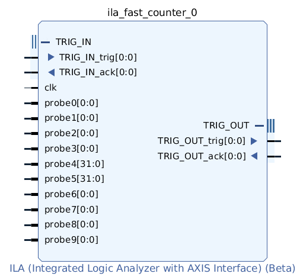

..
  Copyright 2021 Xilinx, Inc.

  Licensed under the Apache License, Version 2.0 (the "License");
  you may not use this file except in compliance with the License.
  You may obtain a copy of the License at

      http://www.apache.org/licenses/LICENSE-2.0

  Unless required by applicable law or agreed to in writing, software
  distributed under the License is distributed on an "AS IS" BASIS,
  WITHOUT WARRANTIES OR CONDITIONS OF ANY KIND, either express or implied.
  See the License for the specific language governing permissions and
  limitations under the License.

ILA
===

The customizable Integrated Logic Analyzer (ILA) IP core is a logic analyzer that can be used
to monitor the internal signals of a design. The ILA core includes many advanced features of
modern logic analyzers, including boolean trigger equations and edge transition triggers.
Because the ILA core is synchronous to the design being monitored, all design clock
constraints that are applied to your design are also applied to the components of the ILA core.

Features Selectable at Design Flow Time:

- Number of probe ports and port widths
- The number of match unit comparators, per port.
- Multiple (logical) Probes may use different bit ranges on the same probe port.
- Waveform Data sample storage depth.
- Trig-In and Trig-Out signal ports.

Features Selectable at Debug Run-Time:

- Probe match values.
- Global boolean trigger condition.
- Waveform window count, window size and Trigger Position.

The ILA class represents one ILA core

ILA Attributes
++++++++++++++
.. autoclass:: chipscopy.api.ila.ila.ILA

ILA Probe Functions
+++++++++++++++++++
There is a logical mapping between ports of an ILA core and elements in the user's design. This port mapping is recorded
in the LTX file in the Vivado design flow.

When an LTX file is read, the HDL net/bus name mapping is available. This enables reading and writing probe values in
the context of the HDL design.

ILA.get_probe_capture_value
"""""""""""""""""""""""""""
.. automethod:: chipscopy.api.ila.ila.ILA.get_probe_capture_value

ILA.get_probe_trigger_value
"""""""""""""""""""""""""""
.. automethod:: chipscopy.api.ila.ila.ILA.get_probe_trigger_value

ILA.reset_probes
""""""""""""""""
.. automethod:: chipscopy.api.ila.ila.ILA.reset_probes

ILA.set_probe_capture_value
"""""""""""""""""""""""""""
.. automethod:: chipscopy.api.ila.ila.ILA.set_probe_capture_value

ILA.set_probe_trigger_value
"""""""""""""""""""""""""""
.. automethod:: chipscopy.api.ila.ila.ILA.set_probe_trigger_value

ILA Run Functions
+++++++++++++++++
The run functions specifies trigger capture options and arms the ILA core.

ILA.refresh_status
""""""""""""""""""
.. automethod:: chipscopy.api.ila.ila.ILA.refresh_status

ILA.monitor_status
""""""""""""""""""
.. automethod:: chipscopy.api.ila.ila.ILA.monitor_status

ILA.run_trigger_immediately
"""""""""""""""""""""""""""
.. automethod:: chipscopy.api.ila.ila.ILA.run_trigger_immediately

ILA.run_basic_trigger
"""""""""""""""""""""
.. automethod:: chipscopy.api.ila.ila.ILA.run_basic_trigger

ILA.wait_till_done
""""""""""""""""""
.. automethod:: chipscopy.api.ila.ila.ILA.wait_till_done

ILA Waveform Functions
++++++++++++++++++++++
ILA functions to upload waveform from core and export.

ILA.upload
""""""""""""""""""""""""""""
.. automethod:: chipscopy.api.ila.ila.ILA.upload

export_waveform
"""""""""""""""
.. automethod:: chipscopy.api.ila.export_waveform

get_waveform_data
"""""""""""""""""
.. automethod:: chipscopy.api.ila.get_waveform_data

get_waveform_probe_data
"""""""""""""""""""""""
.. automethod:: chipscopy.api.ila.get_waveform_probe_data

ILA Data Defintions
+++++++++++++++++++

Constant to indicate trigger position in the middle of the waveform window.

.. autoattribute:: chipscopy.api.ila.ILA_TRIGGER_POSITION_HALF

Constant to indicate maximum window size.

.. autoattribute:: chipscopy.api.ila.ILA_WINDOW_SIZE_MAX

CoreInfo
"""""""""""
.. autoclass:: chipscopy.api.CoreInfo
    :members:

ILABitRange
"""""""""""
.. autoclass:: chipscopy.api.ila.ILABitRange
    :members:

ILACaptureCondition (enum)
""""""""""""""""""""""""""
.. autoclass:: chipscopy.api.ila.ILACaptureCondition
    :members:

ILAControl
""""""""""
.. autoclass:: chipscopy.api.ila.ILAControl
    :members:

ILAPort
"""""""
.. autoclass:: chipscopy.api.ila.ILAPort
    :members:

ILAProbe
""""""""
.. autoclass:: chipscopy.api.ila.ILAProbe
    :members:

ILAProbeValues
""""""""""""""

.. autoattribute:: chipscopy.api.ila.ILA_MATCH_OPERATORS

Operators for probe compare values.

========= =================================================================
Operator  Description
========= =================================================================
==        Equal
!=        Not equal
<         Less than
<=        Equal or less than
>         Greater than
>=        Equal or Greater than
||        Reduction OR
========= =================================================================

.. autoattribute:: chipscopy.api.ila.ILA_MATCH_BIT_VALUES

Binary bit values for probe compare values.

========= =================================================================
Bit Value Description
========= =================================================================
_         Underscore separator for readability.
X         Don't care bit matches any bit-value.
0         Zero
1         One
F         Falling. Transition 1 -> 0
R         Rising. Transition 0 -> 1
L         Laying. Opposite to R.
S         Staying. Opposite to F.
B         Either Falling or Rising.
N         No change. Opposite to B.
========= =================================================================

.. autoclass:: chipscopy.api.ila.ILAProbeValues
    :members:

ILAStaticInfo
"""""""""""""
.. autoclass:: chipscopy.api.ila.ILAStaticInfo
    :members:

ILAStatus
"""""""""
.. autoclass:: chipscopy.api.ila.ILAStatus
    :members:

ILAState (enum)
"""""""""""""""
.. autoclass:: chipscopy.api.ila.ILAState
    :members:

ILATriggerCondition (enum)
""""""""""""""""""""""""""
.. autoclass:: chipscopy.api.ila.ILATriggerCondition
    :members:

ILATrigInMode (enum)
""""""""""""""""""""
.. autoclass:: chipscopy.api.ila.ILATrigInMode
    :members:

ILATrigOutMode (enum)
"""""""""""""""""""""
.. autoclass:: chipscopy.api.ila.ILATrigOutMode
    :members:

ILAWaveform
"""""""""""
.. autoclass:: chipscopy.api.ila.ILAWaveform
    :members:

ILAWaveformProbe
""""""""""""""""
.. autoclass:: chipscopy.api.ila.ILAWaveformProbe
    :members:

