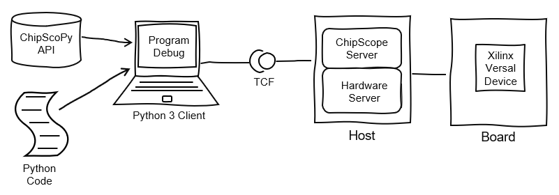

..
  Copyright 2021 Xilinx, Inc.

  Licensed under the Apache License, Version 2.0 (the "License");
  you may not use this file except in compliance with the License.
  You may obtain a copy of the License at

      http://www.apache.org/licenses/LICENSE-2.0

  Unless required by applicable law or agreed to in writing, software
  distributed under the License is distributed on an "AS IS" BASIS,
  WITHOUT WARRANTIES OR CONDITIONS OF ANY KIND, either express or implied.
  See the License for the specific language governing permissions and
  limitations under the License.

======================
ChipScoPy
======================

.. image:: https://img.shields.io/badge/code%20style-black-000000.svg
    :target: https://github.com/psf/black

ChipScoPy is an open-source project from Xilinx® that enables high-level control of Versal debug IP running in hardware.
Using a simple Python API, developers can control and communicate with ChipScope® debug IP such as the Integrated Logic
Analyzer (ILA), Virtual IO (VIO), device memory access, and more.

    ChipScoPy System Diagram

Project source code link: `ChipScoPy <https://www.github.com/Xilinx/chipscopy>`_

|ced_link|

Indices and Tables
==================

* :ref:`genindex`
* :ref:`modindex`
* :ref:`search`

.. toctree::
   :maxdepth: 2
   :caption: Introduction
   :hidden:

   overview.rst
   system_requirements.rst
   chipscopy_installation.rst
   dev_setup.rst

.. toctree::
   :maxdepth: 2
   :caption: ChipScoPy Debug Core API Classes
   :hidden:

   ddr.rst
   ibert.rst
   ila.rst
   memory.rst
   noc.rst
   pcie.rst
   sysmon.rst
   vio.rst

.. toctree::
   :maxdepth: 2
   :caption: Misc Classes & Utility Functions
   :hidden:

   containers.rst
   device.rst
   report.rst
   session.rst
