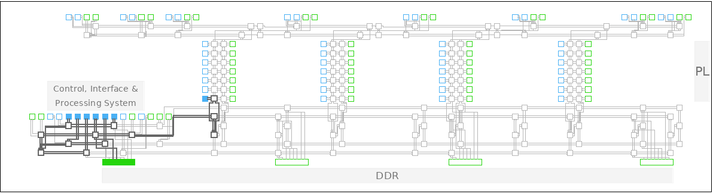
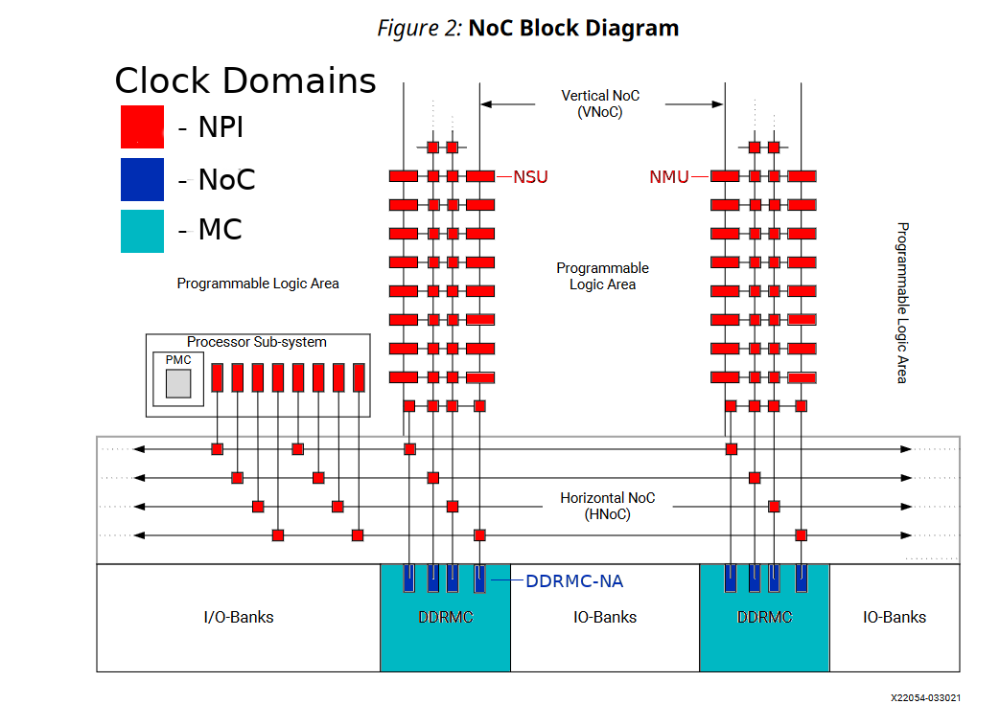

..
  Copyright 2021 Xilinx, Inc.

  Licensed under the Apache License, Version 2.0 (the "License");
  you may not use this file except in compliance with the License.
  You may obtain a copy of the License at

      http://www.apache.org/licenses/LICENSE-2.0

  Unless required by applicable law or agreed to in writing, software
  distributed under the License is distributed on an "AS IS" BASIS,
  WITHOUT WARRANTIES OR CONDITIONS OF ANY KIND, either express or implied.
  See the License for the specific language governing permissions and
  limitations under the License.

NocPerfmon
==========
Xilinx Versal series introduces a high speed, low latency network on chip or NoC. Runtime monitoring of the performance
of this network is possible with the noc-perfmon service.

The image above shows one implementation that uses a small fraction of the network. Each box in the image represents a
node in the network, and each node provides point info on performance.

NoC endpoints are capable of reporting bandwidth and latency of the traffic that flows across the network. Filtering is
an advanced user option that allows the performance to be refined further.

Clock Domains
-------------

There are several clock domains that cover the performance metrics in Versal. Each monitor set is clocked in a single domain.
The clock domains may be configured in the design. See Vivado documenation for Versal for information on how to set or modify
these design frequencies.

Example reference (use diagram from PG313)

The following diagram is a colorized form of the basic NoC structure. See `PG313 NoC Architecture <https://docs.xilinx.com/r/en-US/pg313-network-on-chip/NoC-Architecture>`_ for more details.

Please reference the table below for information on clock domains and which elements belong to each:

+--------------------+---------------------+---------------+------------------+
| Harblock Endpoint  | Metrics             | Clock Domain  | Example Element  |
+====================+=====================+===============+==================+
| NMU (PS, PL, AIE)  | Bandwidth, Latency  | NPI           | NOC_NMU512_X0Y0  |
+--------------------+---------------------+---------------+------------------+
| NSU (PS, PL, AIE)  | Bandwidth, Latency  | NPI           | NOC_NSU512_X0Y0  |
+--------------------+---------------------+---------------+------------------+
| DDRMC NoC Agent    | Bandwidth, Latency  | NoC           | DDRMC_X0Y0       |
+--------------------+---------------------+---------------+------------------+
| DDRMC              | Channel             | MC            | DDRMC_X0Y0       |
+--------------------+---------------------+---------------+------------------+
| HBMMC              | Bandwidth           | HBM           | HBMMC_X0Y0       |
+--------------------+---------------------+---------------+------------------+

References
^^^^^^^^^^

.. toctree::
    :maxdepth: 3

    noc-perfmon/references.rst

