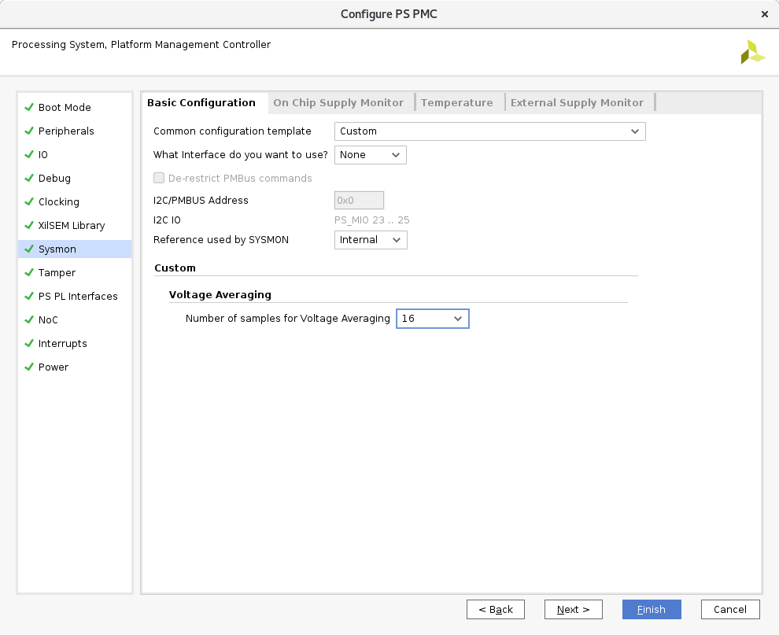

..
   Copyright (C) 2021-2022, Xilinx, Inc.
   Copyright (C) 2022-2024, Advanced Micro Devices, Inc.
   
     Licensed under the Apache License, Version 2.0 (the "License");
     you may not use this file except in compliance with the License.
     You may obtain a copy of the License at
   
         http://www.apache.org/licenses/LICENSE-2.0
   
     Unless required by applicable law or agreed to in writing, software
     distributed under the License is distributed on an "AS IS" BASIS,
     WITHOUT WARRANTIES OR CONDITIONS OF ANY KIND, either express or implied.
     See the License for the specific language governing permissions and
     limitations under the License.

SysMon
==========
The System Monitor block in versal is a redesign from prior Xilinx architectures. Some of the key concepts are the same
but the specifics of the implementation are different in Versal. The basic features are carried forward:

- Device temperature measurement
- Supply voltage measurements
- Bank and VCCINT measurements
- Auxiliary channel measurements through MIO
- VP_VN (low resistance) measurement via dedicated bump
- Averaging, measurement mode control
- Over Temp/Threshold alarms and actions

The typical use case is to configure the SysMon block in the Control Interfaces and Processing Subsystem (CIPS) in the
open design in Vivado. There are more advanced APIs that allow for dynamic reconfiguration of the SysMon block, but the
user assumes responsibility for all outcomes when using these APIs.

References
^^^^^^^^^^

.. toctree::
    :maxdepth: 3

    sysmon/references.rst

